# LifeLink — Diagramme de classes (modèle de données)

6 collections MongoDB (les « classes »/tables) et leurs relations.
Coller le bloc Mermaid ci-dessous dans <https://mermaid.live> pour le visualiser
et l'exporter en image.

```mermaid
classDiagram
    class User {
        +ObjectId _id
        +String name
        +String email  «unique»
        +String password  «bcrypt»
        +String role  «admin|donor|hospital»
        +String status  «active|pending|rejected»
        +String donorId
        +String bloodType
        +Date dateOfBirth
        +String city
        +String[] organs
        +Boolean consent
        +String medicalNotes
        +String emergencyContact
        +String hospitalName
        +String hospitalCity
        +Date createdAt
        +matchPassword(plain) Boolean
    }

    class Organ {
        +ObjectId _id
        +String code  «unique»
        +String name
        +String description
        +Number maxColdIschemiaHours
        +Boolean active
    }

    class DonationRequest {
        +ObjectId _id
        +ObjectId hospital  «FK User»
        +ObjectId organ  «FK Organ»
        +String organName
        +String patientReference
        +String recipientBloodType
        +String urgency  «low|medium|high|critical»
        +String status  «open|matched|fulfilled|cancelled»
        +String notes
        +Date createdAt
    }

    class Match {
        +ObjectId _id
        +ObjectId request  «FK DonationRequest»
        +ObjectId donor  «FK User»
        +ObjectId organ  «FK Organ»
        +Number compatibility
        +String status  «proposed|accepted|declined|completed»
        +Date createdAt
    }

    class Notification {
        +ObjectId _id
        +ObjectId user  «FK User»
        +String type
        +String message
        +Boolean read
        +Date createdAt
    }

    class ActivityLog {
        +ObjectId _id
        +ObjectId user  «FK User»
        +String action
        +String detail
        +Date createdAt
    }

    User "1" --> "0..*" DonationRequest : raises (hospital)
    User "1" --> "0..*" Match : proposed as donor
    User "1" --> "0..*" Notification : receives
    User "1" --> "0..*" ActivityLog : generates
    Organ "1" --> "0..*" DonationRequest : requested
    Organ "1" --> "0..*" Match : concerns
    DonationRequest "1" --> "0..*" Match : produces
```

## Relations (cardinalités)

| De | Vers | Cardinalité | Sens métier |
|----|------|-------------|-------------|
| `User` (hospital) | `DonationRequest` | 1 → N | un hôpital émet plusieurs demandes |
| `User` (donor)    | `Match`           | 1 → N | un donneur peut être proposé pour plusieurs demandes |
| `User`            | `Notification`    | 1 → N | un utilisateur reçoit plusieurs notifications |
| `User`            | `ActivityLog`     | 1 → N | chaque action est tracée |
| `Organ`           | `DonationRequest` | 1 → N | un organe est demandé plusieurs fois |
| `Organ`           | `Match`           | 1 → N | un organe concerne plusieurs matches |
| `DonationRequest` | `Match`           | 1 → N | une demande génère plusieurs matches candidats |

## Notes de conception

- `User` regroupe les trois rôles (admin / donor / hospital) ; les champs
  spécifiques ne sont remplis que selon le rôle. Pour un diagramme avec
  héritage, on peut le présenter comme une super-classe `User` spécialisée en
  `Donor` et `Hospital`.
- `Organ` est un **référentiel** (catalogue), alimenté par le seed.
- `Match` porte un **score de compatibilité** sanguine calculé par le moteur de
  matching (`backend/src/utils/matching.js`).
- Un index unique `(request, donor)` empêche les doublons de match.
